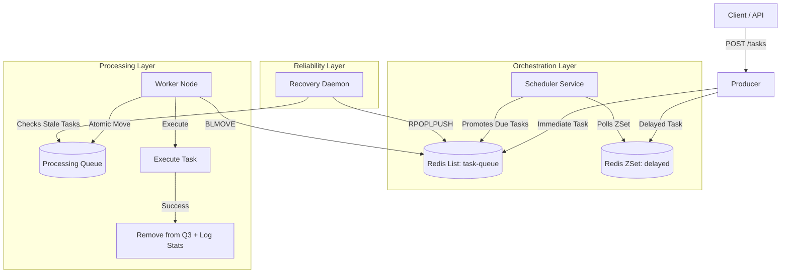

# 🚀 Distributed Fault-Tolerant Task Scheduler

A high-throughput, distributed background job system inspired by **BullMQ** and **Sidekiq**.

This system handles asynchronous task processing, delayed job scheduling, and ensures **At-Least-Once Delivery** through robust crash recovery mechanisms. It includes a real-time React dashboard for observability.

---

## 🏗 System Architecture

The system uses a **Producer-Consumer** pattern with **Redis** as the message broker.

**Key Features**
    1. Distributed & Scalable: Worker nodes are stateless and can be scaled horizontally using Docker.
    
    2. Reliability (Fault Tolerance):
    
        Uses BLMOVE (Atomic Blocking Move) to ensure tasks are never lost if a worker crashes mid-process.
    
        Implements a Recovery Daemon that recycles "zombie" tasks from dead workers back into the main queue.
    
    3. Delayed Scheduling: Supports future task execution using Redis Sorted Sets (ZSET).
    
    4. Real-Time Observability:
    
    5. React + Vite dashboard polling live metrics.
    
    6. Monitors Queue Length, Active Workers, Throughput, and Failure Rates.
    
    7. Infrastructure as Code: Fully containerized Redis environment via Docker Compose.
    

🚀 Getting Started
Prerequisites

Node.js (v18+)

Docker & Docker Compose

1. Start Infrastructure

Start the Redis container:

    docker-compose up -d
2. Install Dependencies

    Backend:

        npm install

   Frontend:

        cd dashboard
        npm install
        cd ..
3. Run the System

    You will need two terminal windows.

    Terminal 1: Backend Services This command uses concurrently to start the API, Worker, and Scheduler in parallel.

        npm run dev
    Terminal 2: Frontend Dashboard

        cd dashboard
        npm run dev

Control Panel Actions

    Add 5 Tasks: Simulates high-throughput traffic. Watch the "Waiting" and "Active" metrics spike.
    
    Add Delayed Task: Schedules a task for 10 seconds in the future. Watch it sit in "Scheduled" before moving to "Active."
    
    Reset System: Clears all Redis keys and metrics.
    
    Simulation: Fault Tolerance (Crash Test)
    
    To test the recovery mechanism:
    
    Add tasks via the dashboard.
    
    Kill Terminal 1 (Ctrl+C) while tasks are in the "Active" state.
    
    Restart npm run dev.
    
    The Recovery Service (built into the worker) will detect the stuck tasks in the processing queue and re-run them automatically.
