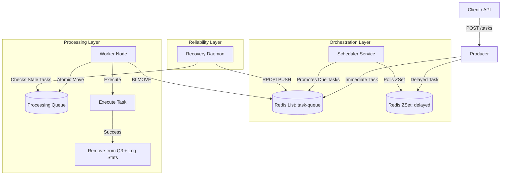

# 🚀 Distributed Fault-Tolerant Task Scheduler

A high-throughput, distributed background job system inspired by **BullMQ** and **Sidekiq**.

This system handles asynchronous task processing, delayed job scheduling, and ensures **At-Least-Once Delivery** through robust crash recovery mechanisms. It includes a real-time React dashboard for observability.

---

## 🏗 System Architecture

The system uses a **Producer-Consumer** pattern with **Redis** as the message broker.

